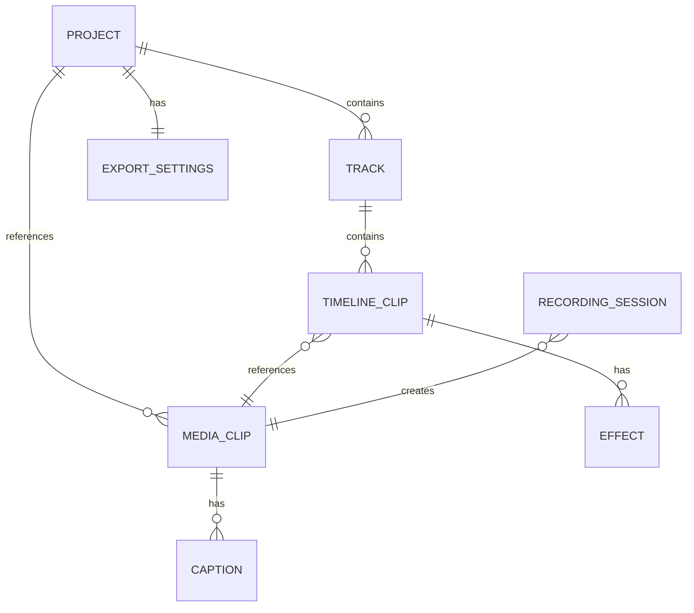

# Data Model: ClipForge

**Feature**: ClipForge Desktop Video Editor  
**Date**: 2025-10-27  
**Purpose**: Define entity models, relationships, validation rules, and state transitions

## Entity Overview



---

## Core Entities

### Project

Represents a complete editing project with timeline state, media references, and export settings.

**Fields**:
- `id`: String (UUID) - Unique project identifier
- `name`: String - User-facing project name (default: "Untitled Project")
- `created_at`: DateTime (ISO 8601) - Project creation timestamp
- `modified_at`: DateTime (ISO 8601) - Last modification timestamp
- `file_path`: String (optional) - Absolute path to saved .clipforge file
- `version`: String - Project file format version (e.g., "1.0.0")
- `tracks`: Array<Track> - Timeline tracks (ordered by priority)
- `media_library`: Array<MediaClip> - All imported clips
- `export_settings`: ExportSettings - Default export configuration
- `auto_save_enabled`: Boolean - Auto-save state (default: true)
- `last_auto_save`: DateTime (optional) - Most recent auto-save timestamp

**Relationships**:
- Has many `Track` (1:N)
- Has many `MediaClip` (1:N)
- Has one `ExportSettings` (1:1)

**Validation Rules**:
- `name` must not be empty (min 1 char, max 255 chars)
- `version` must match semantic versioning pattern (e.g., "1.0.0")
- `tracks` must contain at least 1 track
- `modified_at` must be >= `created_at`

**State Transitions**:
```
[New] -> [Modified] -> [Saved] -> [Modified] -> ...
  |                       |
  v                       v
[Closed]              [Closed]
```

---

### MediaClip

Represents a video file imported into the media library.

**Fields**:
- `id`: String (UUID) - Unique clip identifier
- `name`: String - Display name (derived from filename)
- `source_path`: String - Absolute path to original video file
- `proxy_path`: String (optional) - Path to generated proxy video (1080p H.264)
- `thumbnail_path`: String (optional) - Path to thumbnail image (JPEG)
- `duration`: Float - Total clip duration in seconds
- `resolution`: String - Video resolution (e.g., "1920x1080", "3840x2160")
- `width`: Integer - Video width in pixels
- `height`: Integer - Video height in pixels
- `fps`: Float - Frame rate (frames per second)
- `codec`: String - Video codec (e.g., "h264", "hevc", "vp9")
- `audio_codec`: String (optional) - Audio codec (e.g., "aac", "mp3")
- `file_size`: Integer - File size in bytes
- `bitrate`: Integer (optional) - Video bitrate in kbps
- `has_audio`: Boolean - Whether clip contains audio track
- `imported_at`: DateTime - Import timestamp
- `captions`: Array<Caption> (optional) - Generated/edited captions

**Relationships**:
- Referenced by many `TimelineClip` (1:N)
- May have many `Caption` (1:N)
- May be created by one `RecordingSession` (N:1)

**Validation Rules**:
- `source_path` must exist on filesystem (validated on load)
- `duration` must be > 0
- `width` and `height` must be > 0
- `fps` must be > 0 and <= 120
- `resolution` format: "{width}x{height}"
- `codec` must be in supported list: ["h264", "hevc", "vp9", "vp8", "prores"]

**Derived Properties**:
- `aspect_ratio`: width / height (e.g., 1.778 for 16:9)
- `is_4k`: width >= 3840
- `is_hd`: width >= 1920
- `display_duration`: Format duration as "MM:SS" or "HH:MM:SS"

---

### TimelineClip

Represents an instance of a MediaClip placed on the timeline with edit decisions.

**Fields**:
- `id`: String (UUID) - Unique timeline clip identifier
- `media_clip_id`: String (UUID) - Reference to source MediaClip
- `track_id`: String (UUID) - Parent track identifier
- `start_time`: Float - Position on timeline in seconds (where clip starts)
- `in_point`: Float - Trim start point in source clip (seconds)
- `out_point`: Float - Trim end point in source clip (seconds)
- `effects`: Array<Effect> (optional) - Applied effects
- `layer_order`: Integer - Z-index for overlay positioning (higher = on top)
- `transform`: Transform (optional) - Position/scale for overlays

**Relationships**:
- Belongs to one `Track` (N:1)
- References one `MediaClip` (N:1)
- May have many `Effect` (1:N)

**Validation Rules**:
- `start_time` must be >= 0
- `in_point` must be >= 0 and < source clip duration
- `out_point` must be > `in_point` and <= source clip duration
- `layer_order` must be >= 0
- Clips on same track must not overlap (validated on insert/move)

**Derived Properties**:
- `duration`: out_point - in_point (effective clip length on timeline)
- `end_time`: start_time + duration (where clip ends on timeline)
- `trimmed_duration_display`: Format as "MM:SS"

**State Transitions**:
```
[Created] -> [On Timeline] -> [Trimmed] -> [Split] -> [Deleted]
                |                 |
                v                 v
            [Moved]          [Effects Applied]
```

---

### Track

Represents a horizontal layer on the timeline that contains clips.

**Fields**:
- `id`: String (UUID) - Unique track identifier
- `name`: String - Track display name (e.g., "Track 1", "Overlay")
- `type`: Enum - Track type: "main" | "overlay"
- `order`: Integer - Vertical position (0 = bottom, higher = top)
- `clips`: Array<TimelineClip> - Clips on this track (ordered by start_time)
- `visible`: Boolean - Track visibility (default: true)
- `locked`: Boolean - Prevent edits (default: false)
- `volume`: Float - Track audio level (0.0 - 1.0, default: 1.0)

**Relationships**:
- Belongs to one `Project` (N:1)
- Has many `TimelineClip` (1:N)

**Validation Rules**:
- `name` must not be empty (max 50 chars)
- `order` must be >= 0
- `volume` must be 0.0 <= volume <= 1.0
- Track of type "main" must exist (at least one)

**Derived Properties**:
- `duration`: Maximum end_time of all clips on track
- `clip_count`: Number of clips on track

---

### Caption

Represents a timestamped text caption/subtitle.

**Fields**:
- `id`: String (UUID) - Unique caption identifier
- `media_clip_id`: String (UUID) - Parent clip reference
- `text`: String - Caption text content
- `start_time`: Float - Caption start time in seconds (relative to clip)
- `end_time`: Float - Caption end time in seconds
- `confidence`: Float (optional) - Speech recognition confidence (0.0 - 1.0)
- `language`: String - Language code (ISO 639-1, e.g., "en", "es")
- `styling`: CaptionStyle (optional) - Font, color, position

**Relationships**:
- Belongs to one `MediaClip` (N:1)

**Validation Rules**:
- `text` must not be empty (max 500 chars per caption)
- `start_time` must be >= 0 and < parent clip duration
- `end_time` must be > `start_time` and <= parent clip duration
- `confidence` (if present) must be 0.0 <= confidence <= 1.0

**Derived Properties**:
- `duration`: end_time - start_time
- `word_count`: Number of words in text

---

### Effect

Represents a visual or audio modification applied to a timeline clip.

**Fields**:
- `id`: String (UUID) - Unique effect identifier
- `timeline_clip_id`: String (UUID) - Parent clip reference
- `type`: Enum - Effect type: "transition" | "filter" | "text_overlay" | "audio_adjustment"
- `name`: String - Effect display name (e.g., "Fade In", "Brightness +20%")
- `parameters`: Object - Effect-specific parameters (JSON)
- `enabled`: Boolean - Effect active state (default: true)

**Relationships**:
- Belongs to one `TimelineClip` (N:1)

**Validation Rules**:
- `type` must be valid enum value
- `parameters` schema validated per effect type

**Effect Type Parameters**:

**Transition** (fade, slide, dissolve):
```json
{
  "duration": 1.0,        // Transition duration in seconds
  "style": "fade",        // "fade" | "slide" | "dissolve"
  "direction": "in"       // "in" | "out"
}
```

**Filter** (brightness, contrast, saturation):
```json
{
  "brightness": 1.2,      // Multiplier (1.0 = no change)
  "contrast": 1.1,
  "saturation": 0.9
}
```

**Text Overlay**:
```json
{
  "text": "Hello World",
  "font": "Arial",
  "size": 48,
  "color": "#FFFFFF",
  "position": {"x": 100, "y": 100},
  "alignment": "center"   // "left" | "center" | "right"
}
```

**Audio Adjustment**:
```json
{
  "volume": 0.8,          // 0.0 - 1.0
  "fade_in": 0.5,         // Fade in duration (seconds)
  "fade_out": 0.5         // Fade out duration (seconds)
}
```

---

### RecordingSession

Represents an active or completed screen/webcam recording.

**Fields**:
- `id`: String (UUID) - Unique session identifier
- `type`: Enum - Recording type: "screen" | "webcam" | "screen_webcam"
- `status`: Enum - Session status: "preparing" | "recording" | "paused" | "stopped" | "failed"
- `output_path`: String - Path where recording will be saved
- `started_at`: DateTime (optional) - Recording start timestamp
- `stopped_at`: DateTime (optional) - Recording stop timestamp
- `duration`: Float (optional) - Total recorded duration in seconds
- `screen_source`: String (optional) - Screen/window identifier being recorded
- `camera_device`: String (optional) - Camera device identifier
- `audio_sources`: Array<String> - Audio input identifiers ["microphone", "system"]
- `resolution`: String - Recording resolution (e.g., "1920x1080")
- `fps`: Integer - Recording frame rate (default: 30)
- `error_message`: String (optional) - Error description if status = "failed"
- `created_media_clip_id`: String (UUID, optional) - MediaClip created from recording

**Relationships**:
- May create one `MediaClip` (1:1, after recording complete)

**Validation Rules**:
- `type` must be valid enum value
- `resolution` must be valid format: "{width}x{height}"
- `fps` must be 15, 24, 30, or 60
- If type = "screen_webcam", both `screen_source` and `camera_device` must be set

**State Transitions**:
```
[Preparing] -> [Recording] <-> [Paused] -> [Stopped] -> [Media Created]
     |              |
     v              v
  [Failed]      [Failed]
```

---

### ExportSettings

Represents export configuration for rendering timeline to video file.

**Fields**:
- `resolution`: Enum - Output resolution: "source" | "2160p" | "1440p" | "1080p" | "720p" | "480p"
- `codec`: Enum - Video codec: "h264" | "hevc" | "vp9"
- `quality`: Enum - Encoding quality: "high" | "medium" | "low"
- `fps`: Integer (optional) - Override frame rate (null = use source fps)
- `audio_codec`: Enum - Audio codec: "aac" | "mp3" | "opus"
- `audio_bitrate`: Integer - Audio bitrate in kbps (default: 192)
- `hardware_acceleration`: Boolean - Enable hardware encoding (default: true)

**Validation Rules**:
- `resolution` must be valid enum value
- `fps` (if set) must be 24, 30, or 60
- `audio_bitrate` must be 128, 192, or 320

**Derived Properties**:
- `output_extension`: File extension based on codec (".mp4", ".webm")
- `estimated_file_size`: Rough estimate based on duration and quality

---

### Transform (Embedded Object)

Represents position and scale transformations for overlay clips.

**Fields**:
- `x`: Integer - Horizontal position in pixels (0 = left edge)
- `y`: Integer - Vertical position in pixels (0 = top edge)
- `width`: Integer - Scaled width in pixels
- `height`: Integer - Scaled height in pixels
- `rotation`: Float - Rotation angle in degrees (default: 0.0)

**Validation Rules**:
- `x`, `y` must be >= 0
- `width`, `height` must be > 0
- `rotation` range: -360.0 <= rotation <= 360.0

---

### CaptionStyle (Embedded Object)

Represents styling for captions.

**Fields**:
- `font`: String - Font family (default: "Arial")
- `size`: Integer - Font size in points (default: 24)
- `color`: String - Text color (hex format, e.g., "#FFFFFF")
- `background_color`: String (optional) - Background color (hex or "transparent")
- `position`: Enum - Screen position: "top" | "center" | "bottom" (default: "bottom")
- `alignment`: Enum - Text alignment: "left" | "center" | "right" (default: "center")

**Validation Rules**:
- `font` must not be empty
- `size` range: 12 <= size <= 72
- `color` must match hex pattern: `^#[0-9A-Fa-f]{6}$`

---

## Entity Lifecycle

### Project Lifecycle

```
1. New Project
   - Create Project with default track
   - Initialize empty media library
   - Set auto_save_enabled = true

2. Import Media
   - Create MediaClip
   - Generate thumbnail (async)
   - Generate proxy (async, optional)
   - Add to media_library array

3. Edit Timeline
   - Add TimelineClip to Track
   - Modify in_point/out_point (trim)
   - Split clip (create two TimelineClip from one)
   - Apply effects
   - Update modified_at timestamp

4. Auto-Save
   - Every 2 minutes (if modified_at changed)
   - Serialize to JSON
   - Write to temp file
   - Store in auto_save cache

5. Save Project
   - User triggers explicit save
   - Serialize to JSON
   - Write to .clipforge file
   - Update file_path and modified_at

6. Export Video
   - Generate FFmpeg command from timeline
   - Execute export with progress tracking
   - Save to user-selected location

7. Close Project
   - Check for unsaved changes
   - Prompt user if modified_at > last save
   - Clear memory state
```

---

### Recording Lifecycle

```
1. Prepare Recording
   - Create RecordingSession (status = "preparing")
   - Request platform permissions (screen/camera/mic)
   - Select recording sources
   - Generate output_path

2. Start Recording
   - Change status to "recording"
   - Set started_at timestamp
   - Begin platform-specific capture

3. Recording Active
   - Update duration in real-time
   - Monitor for errors

4. Stop Recording
   - Change status to "stopped"
   - Set stopped_at timestamp
   - Finalize video file

5. Create Media
   - Generate MediaClip from output_path
   - Extract metadata
   - Generate thumbnail
   - Add to media_library
   - Set created_media_clip_id
```

---

## Data Persistence

### Project File Format (.clipforge)

**Format**: JSON (human-readable)

**Example**:
```json
{
  "version": "1.0.0",
  "id": "proj-123e4567",
  "name": "Tutorial Video",
  "created_at": "2025-10-27T10:00:00Z",
  "modified_at": "2025-10-27T12:30:00Z",
  "tracks": [
    {
      "id": "track-1",
      "name": "Main Track",
      "type": "main",
      "order": 0,
      "visible": true,
      "locked": false,
      "volume": 1.0,
      "clips": [
        {
          "id": "clip-1",
          "media_clip_id": "media-abc",
          "track_id": "track-1",
          "start_time": 0.0,
          "in_point": 2.5,
          "out_point": 12.5,
          "layer_order": 0,
          "effects": []
        }
      ]
    }
  ],
  "media_library": [
    {
      "id": "media-abc",
      "name": "Intro Clip.mp4",
      "source_path": "/Users/creator/Videos/intro.mp4",
      "proxy_path": "/Users/creator/.clipforge/proxies/media-abc.mp4",
      "thumbnail_path": "/Users/creator/.clipforge/thumbnails/media-abc.jpg",
      "duration": 30.0,
      "resolution": "1920x1080",
      "width": 1920,
      "height": 1080,
      "fps": 30.0,
      "codec": "h264",
      "audio_codec": "aac",
      "file_size": 52428800,
      "has_audio": true,
      "imported_at": "2025-10-27T10:05:00Z"
    }
  ],
  "export_settings": {
    "resolution": "1080p",
    "codec": "h264",
    "quality": "high",
    "audio_codec": "aac",
    "audio_bitrate": 192,
    "hardware_acceleration": true
  },
  "auto_save_enabled": true,
  "last_auto_save": "2025-10-27T12:28:00Z"
}
```

---

### SQLite Cache Schema

**Purpose**: Store metadata for fast queries (thumbnail paths, proxy generation status)

```sql
-- Media clip metadata cache
CREATE TABLE media_clips (
    id TEXT PRIMARY KEY,
    source_path TEXT NOT NULL,
    thumbnail_path TEXT,
    proxy_path TEXT,
    duration REAL NOT NULL,
    resolution TEXT NOT NULL,
    codec TEXT NOT NULL,
    imported_at INTEGER NOT NULL,
    UNIQUE(source_path)
);

-- Auto-save snapshots
CREATE TABLE auto_saves (
    id INTEGER PRIMARY KEY AUTOINCREMENT,
    project_id TEXT NOT NULL,
    snapshot_data TEXT NOT NULL,  -- JSON serialized project
    saved_at INTEGER NOT NULL
);

-- Recording sessions (for recovery)
CREATE TABLE recording_sessions (
    id TEXT PRIMARY KEY,
    type TEXT NOT NULL,
    status TEXT NOT NULL,
    output_path TEXT,
    started_at INTEGER,
    stopped_at INTEGER,
    created_media_clip_id TEXT
);

-- Indexes for performance
CREATE INDEX idx_media_source_path ON media_clips(source_path);
CREATE INDEX idx_auto_saves_project ON auto_saves(project_id, saved_at DESC);
CREATE INDEX idx_recording_status ON recording_sessions(status);
```

---

## Validation Rules Summary

### Project-Level Validation

```typescript
function validateProject(project: Project): ValidationResult {
  if (!project.name || project.name.length === 0) {
    return error("Project name cannot be empty");
  }
  if (project.tracks.length === 0) {
    return error("Project must have at least one track");
  }
  if (project.modified_at < project.created_at) {
    return error("Modified timestamp cannot be before created timestamp");
  }
  // Check all media_clip_ids in timeline exist in media_library
  const mediaIds = new Set(project.media_library.map(m => m.id));
  for (const track of project.tracks) {
    for (const clip of track.clips) {
      if (!mediaIds.has(clip.media_clip_id)) {
        return error(`Timeline references missing media clip: ${clip.media_clip_id}`);
      }
    }
  }
  return success();
}
```

### Timeline Validation

```typescript
function validateTimelineClips(track: Track): ValidationResult {
  const clips = track.clips.sort((a, b) => a.start_time - b.start_time);
  
  for (let i = 0; i < clips.length - 1; i++) {
    const current = clips[i];
    const next = clips[i + 1];
    
    if (current.end_time > next.start_time) {
      return error(`Clips overlap: ${current.id} and ${next.id}`);
    }
  }
  
  return success();
}
```

---

## Summary

**Total Entities**: 8 core entities + 2 embedded objects

**Key Design Principles**:
- **Normalized references**: TimelineClip references MediaClip (no duplication)
- **Derived properties**: Compute duration, end_time on demand (not stored)
- **Validation at boundaries**: Validate on create/update, not on read
- **Flexible storage**: JSON for projects (human-readable), SQLite for cache (queryable)
- **Type safety**: Strong typing for all enums and fields

**Next Steps**: Generate API contracts (Tauri commands) based on these entities

